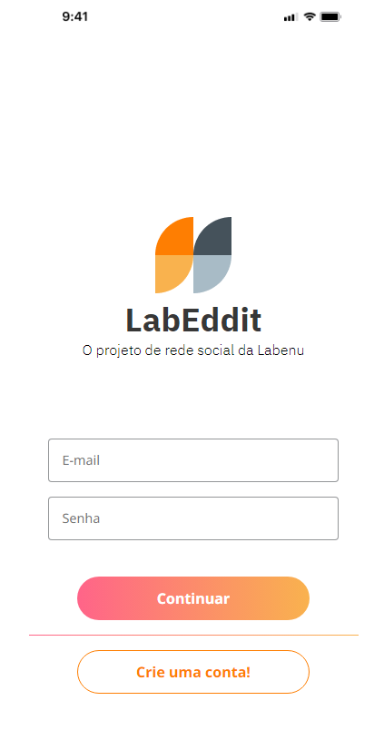

# Labeddit Frontend
Um website foi criado com a intenção de servir como uma plataforma de mídia social dedicada à postagem de perguntas e dúvidas, possibilitando aos usuários a interação através de curtidas e comentários em cada publicação.

### Prévia do Site

## Lista de requisitos

- [x]  Respeitar o layout do Figma
- [x]  Uso do ReactJS
- [x]  Site deployado
- [x]  Documentação README

## Tecnologias Utilizadas

- React (Router, Context, Custom Hooks, style-components )
- Git
- Figma
- Axios
- Integração com API Restfull

## Deploy

[Click aqui para ir ao site](https://projeto-labeeddit.surge.sh/)

